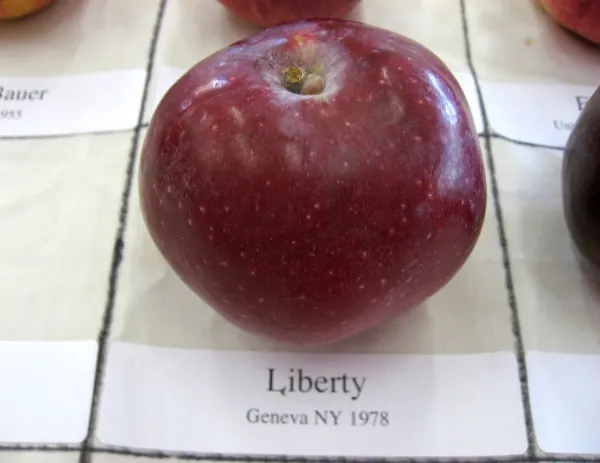
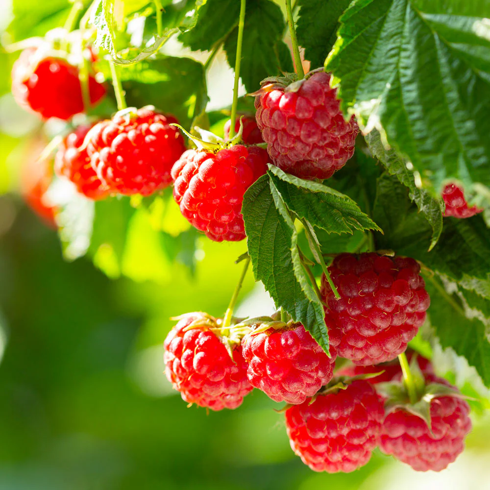

# Photo Implementation Guide

## Overview
Your website is now structured with visual placeholders ready for plant variety photos. This guide shows exactly how to replace each placeholder with actual images.

## Current Photo Placeholders

### 🍎 Fruit Trees Section (Featured Cards)
1. **Liberty Apple** - Red gradient placeholder
2. **Freedom Apple** - Green gradient placeholder  
3. **Reliance Peach** - Orange gradient placeholder

### 🌿 Understory Plants Section (Plant Cards)
4. **Caroline Raspberry** - Red/pink gradient placeholder
5. **American Black Elderberry** - Purple gradient placeholder
6. **Black Chokeberry** - Indigo gradient placeholder
7. **Wild Strawberry** - Green gradient placeholder
8. **Creeping Thyme** - Pink gradient placeholder
9. **Wild Bergamot** - Purple gradient placeholder

### 🌱 Additional Plants Needing Photos
10. **Ostrich Fern** - For shopping list enhancement

## Step-by-Step Implementation

### Step 1: Source and Prepare Images
- **Image Size**: 800px wide minimum, 600px tall for best quality
- **File Format**: WebP (recommended for best compression and quality)
- **File Names**: Use descriptive names matching the plants:
  ```
  liberty-apple.webp
  freedom-apple.webp
  reliance-peach.webp
  caroline-raspberry.webp
  elderberry-flowers.webp
  elderberry-berries.webp
  chokeberry-fall.webp
  wild-strawberry.webp
  creeping-thyme.webp
  wild-bergamot.webp
  ostrich-fern.webp
  ```

### Step 2: Add Images to Your Repository
1. Create an `images` folder in your project directory
2. Upload all photos to the `images` folder
3. Ensure file names match exactly (case-sensitive)

### Step 3: Replace Placeholders in HTML

#### For Fruit Trees (3 locations):
Replace this placeholder structure:
```html
<div class="h-48 bg-gradient-to-br from-red-100 to-red-200 flex items-center justify-center">
    <div class="text-center text-red-800">
        <svg class="w-16 h-16 mx-auto mb-2" fill="currentColor" viewBox="0 0 20 20">
            <path d="M10 2L8 8h4l-2-6z M6 10c0 2.21 1.79 4 4 4s4-1.79 4-4"/>
        </svg>
        <p class="text-sm">Liberty Apple<br>Photo Needed</p>
    </div>
</div>
```

With this image structure:
```html

```

#### For Plant Cards (6 locations):
Replace this placeholder structure:
```html
<div class="h-48 bg-gradient-to-br from-red-100 to-pink-200 flex items-center justify-center">
    <div class="text-center text-red-700">
        <svg class="w-12 h-12 mx-auto mb-2" fill="currentColor" viewBox="0 0 20 20">
            <path d="..."/>
        </svg>
        <p class="text-xs">Raspberry 'Caroline'<br>Photo Needed</p>
    </div>
</div>
```

With this image structure:
```html

```

### Step 4: Recommended Image Sources

#### Free Options:
- **Wikimedia Commons**: Search for specific variety names
- **USDA Plants Database**: Professional botanical photos
- **University Extension Services**: Often have variety-specific images
- **Fedco Seeds**: Check their catalog for photos of varieties you're buying

#### Search Tips:
- Use exact variety names: "Liberty apple tree"
- Look for images showing fruit/flowers/berries
- Prioritize images that show the plant in landscape settings
- For native plants, search "[plant name] native Vermont"

#### Quick Links for Sourcing:
- Liberty Apple: Search "Liberty apple disease resistant"
- Freedom Apple: Search "Freedom apple variety tree"
- Reliance Peach: Search "Reliance peach cold hardy Vermont"
- Caroline Raspberry: Search "Caroline everbearing raspberry"
- Black Elderberry: Search "Sambucus canadensis flowers berries"
- Black Chokeberry: Search "Aronia melanocarpa fall foliage"
- Wild Strawberry: Search "Fragaria virginiana native groundcover"
- Creeping Thyme: Search "Thymus serpyllum flowers"
- Wild Bergamot: Search "Monarda fistulosa lavender flowers"
- Ostrich Fern: Search "Matteuccia struthiopteris fiddleheads"

### Step 5: Commit and Push Changes
Once you've replaced the placeholders:
```bash
git add images/
git add index.html
git commit -m "Add plant variety photos to enhance visual presentation"
git push
```

## Alternative: Quick Implementation with Stock Photos
If you want to get started quickly, you can use high-quality stock photos from Unsplash or Pexels while you source variety-specific images:

1. **Unsplash.com** - Search for generic plant types
2. **Pexels.com** - Free stock photos
3. **Pixabay.com** - Creative commons images

## Pro Tips:
- **Multiple Photos**: For elderberry, consider using both flower and berry photos
- **Seasonal Variety**: Chokeberry could show both berries and fall foliage
- **Context Shots**: Images showing plants in garden settings work best
- **Consistent Styling**: Try to match lighting and style across photos
- **Alt Text**: Always include descriptive alt text for accessibility

## File Size Optimization:
Before uploading, convert and compress images to WebP format (~50-150KB each) using:
- **Online tools**: Squoosh.app (Google's WebP converter), TinyPNG
- **Image editors**: Photoshop, GIMP (export as WebP at 80-85% quality)
- **Command line**: `cwebp input.jpg -q 80 -o output.webp`

WebP format provides 25-35% better compression than JPEG while maintaining quality, ensuring faster loading times.
